# MÓDULO 2: Switching, Routing, and Wireless Essentials

## Semana 7

### Modelo Jerárquico


Estructura o topología que consta de 3 capas (divididas por switches)

- Capa de acceso
  - Distribuye la información a los dispositivos
- Capa de distribución
  - **Reenvía** la trama hacie el núcleo o acceso
  - Sirve para evitar la sobre carga en las otras dos capas
- Capa de núcleo
  - Tiene la **comunicación** directa hacia el **exterior**.

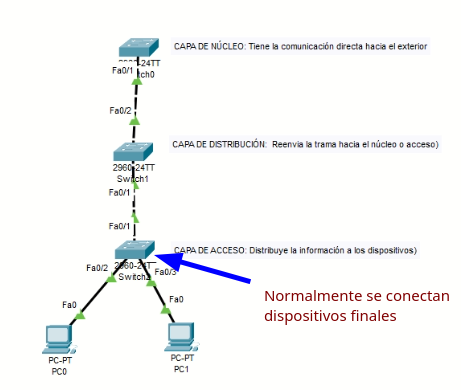

Todo el tráfico interno pasa de la capa de acceso y tiene que llegar hasta la capa de núcleo para poder salir.

**Switch con núcleo contraido**

La capa de núlceo y distribución de combina gracias al switch múlticapa

> A partir del modelo 3500 de los switches de CISCO, son capa 3 o multicapa

- Tienen mayor capacidad
- Va a poder funcionar como router o como switch

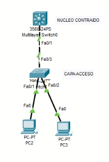

Se recomienda que los servidores esten en otro segmento.

Podemos tener un **stack entre switches** (o apilamiento): Funcionar los switches,se hace una configuración para poder aprovechar los puertos de 2 switches.

### VLANs

Son LANs virtuales. No son LANs físifcas, van a ser creadas virtualmente por medio de switch.

Las VLANs interactuan en capa 2 del modelo OSI

- Rango normal: 1 a 1005
- Rango extendido: 1006 a 4094

Número máximo de vlans son 4096

Archivo `vlan.dat` almacenado en la NVRAM

Tenemos vlans de datos y de voz

```sh
show vlan brief
```

_2 formas para colocar mis puertos_ a la hora de configurar las VLANs

- Puertos en modo acceso: Solo permite el tráfico de un vlan
- Puerto en modo truncal: Permite el tráfico de 1 o más vlans

_¿Para qué sirven las vlans?_

- Por seguridad, **separa** por departamientos (los servidores, los de IT, secretarias)
- Se tiene mejor estructurada la red.
- Cada depto. tiene una dirección privada.
- Por cada VLAN es un segmento (dominio broadcast) diferente.
- Por defecto la vlan config. es la vlan 1.

_¿Qué modo elegir?_

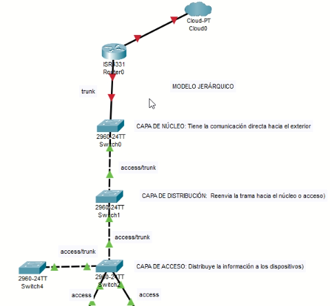

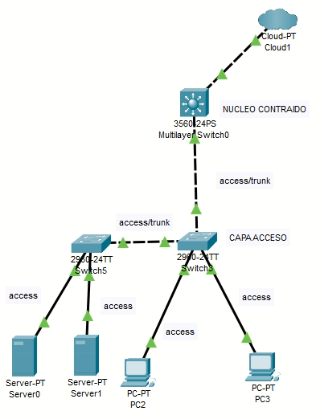

### Mini práctica (VLANS)

- Las vlan 1002 - 1005 son intocables, ya vienen de fábrica y no las podemos eliminar.

1. Ver las VLANs creadas

   ```sh
   show vlan brief
   ```

   La información que nos da:

   - Número de VLAN
   - Nombre de la VLAN
   - El estado de la VLAN
   - Los puertos asignados

   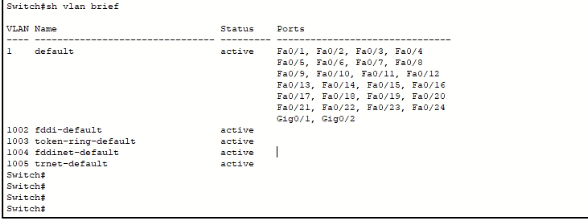

2. Arrastramos 2 switches, 2 host y armamos la siguiente configuración

   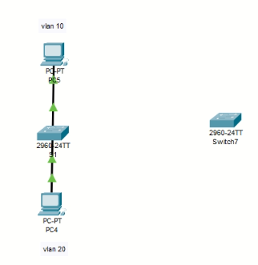

3. Ahora para configurar las vlans, el switch

   ```sh
   #M-CG
   vlan 10
   name vlan10
   exit

   vlan 20
   name vlan20
   exit

   vlan 30
   exit
   ```

4. Ahora, vamos a configurar los puertos que van a pertenecer a determinada vlan

   ```sh
   # Borrar un vlan
   no vlan 30

   # Configurando puertos en vlans
   interface fa0/1

   # COnfiguramos el puerto en modo de acceso
   switchport mode access
   switchport access vlan 20
   exit

   interface fa0/2

   switchport mode access
   switchport access vlan 10
   exit

    host name S1
    show vlan brief
   ```

5. Cada vlan es un segmento de red completamente separado. Es un dominio broadcast diferente.

   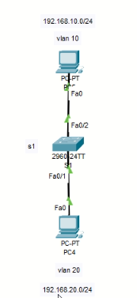

   Configurar los hosts

   

6. Si intentamos hace `ping` y debe fallar

   - Son dos vlans diferentes, por lo tanto no se deben conocer.
   - Si ambos pertenecen a la misma vlan, se deben poder comunicar, agregamos otro host para verificar
     - Recordar hacer toda la configuración del paso 4

7. ¿Qué pasa si tengo 2 switches ?

   - Se ilustrará el ejemplo de modo acceso y modo truncal

   Realizar la siguiente configuración

   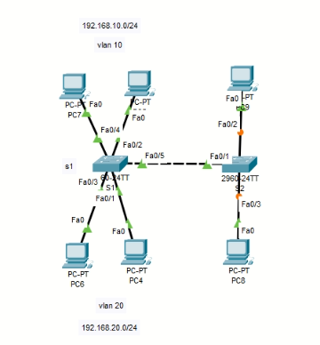

   - Modo acceso

     - Tenemos que configurar 2 puertos.

       - Uno para vlan 10 y
       - Otro para vlan 20

       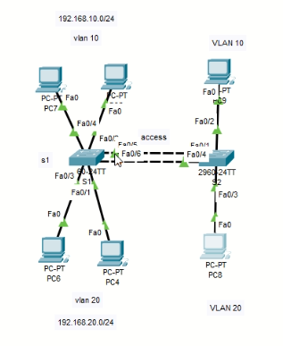

     ```sh
     # S1
     interface fa0/5
     switchport mode access
     switch access vlan 10
     exit

     interface fa0/6
     switchport mode access
     switch access vlan 20
     exit

     show vlan brief
     ## Deberian ser 3 y 3


     # S2
     # Debemos empezar de cero
     # M-CG
     vlan 10
     vlan 20
     exit

     interface range fa0/1-2
     switchport mode access
     switchport access vlan 10
     exit

     interface range fa0/3-4
     switchport mode access
     switchport access vlan 20
     exit

     hostname S2
     show vlan brief
     ```

- Colocar IPs a los hosts
- Hacer ping entre host de la misma vlan (deberíamos llegar)

  - Modo truncal

    Vamos a agradar este ejemplo,

    Características del truncal

    - Usar el protocolo 802.1q

  ```sh
  show running-config
  show interfaces trunk
  ```

  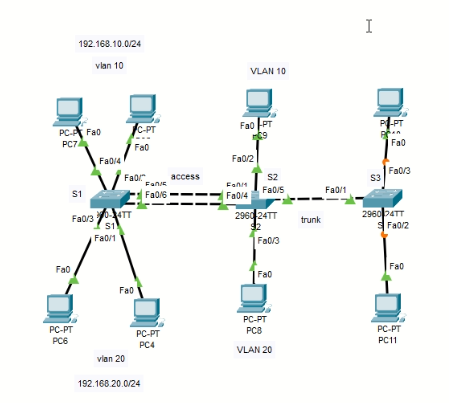

  ```sh
  # S2
  interface fa0/5
  switchport mode trunk

  # S3
  hostname S3
  interface fa0/1
  switchport mode trunk
  exit

  vlan 10
  vlan 20
  intercace fa0/2
  switchport mode access
  switchport access vlan 10
  exit

  intercace fa0/3
  switchport mode access
  switchport access vlan 20
  exit

  show vlan brief
  # No muestra vlans truncales

  # Mostrar vlans en modoe troncal
  show interfaces trunk
  ```

  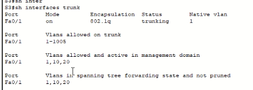

  Podemos restringir las vlan que queremos dejar pasar por el puerto modo truncal

  ```sh
  interface fa0/1
  switchport trunk allowed vlan 10,20

  # Para este ejercicio lo quitamos
  no switchport trunk allowed vlan 10,20
  ```

  No olvidar asignar IPs
  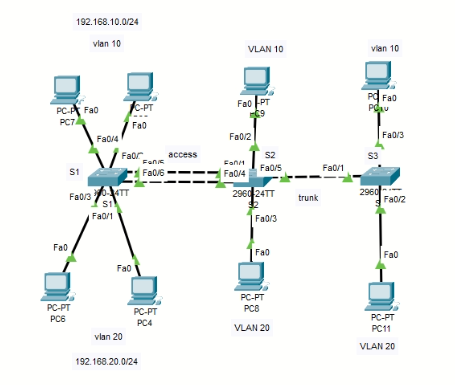

¿Cómo sabe el enlace troncal a que vlan le pertence el mensaje?

El mensaje (paquete) viaja con una etiqueta

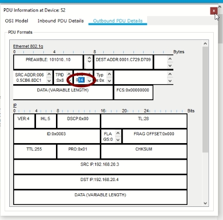

Con la **VLAN nativa** los mensajes viajan sin la etiqueta

¿Cómo le hacen para comunicarse?

Realizamos lo siguiente:

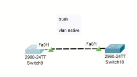

```sh
# Swith de la izq
interface fa0/1
switchport mode trunk
switchport trunk native vlan 99

# Swith de la der
interface fa0/1
switchport mode trunk
switchport trunk native vlan 99
```

> ¿Cómo puedo comunicar host de diferentes VLANs?

### Router on Stick

Enrutamiento entre vlans (comunicación entre host de diferentes vlans)

Se van a crear interfaces lógicas en una interfaz física

- Primero levantamos las interfaces lógicas y al final encendemos las interfaces físicas.

Utilizaremos la topología de la práctica pasada y le agregaremos un router

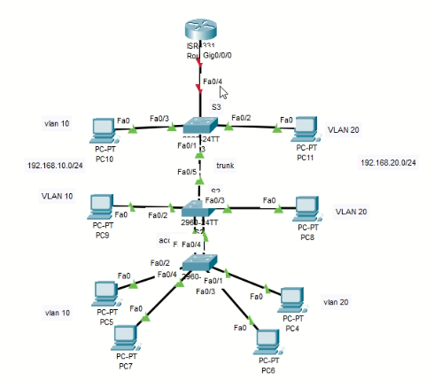

```sh
# Colocamos la interfaz del switch al router en modo truncal

# M-CG
# interface fax/x.V
interface gi0/0/0.10
#encapsulation dot1q V
encapsulation dot1q 10
ip address 192.168.10.254 255.255.255.0
exit

# Activando subinterfaz 20
interface gi0/0/0.20
encapsulation dot1q 20
ip address 192.168.20.254 255.255.255.0
exit

interface gi0/0/0
no shutdown

# X representa el número de la interfaz
# V al número de VLAN

show running-config
show ip interface brief

# No olvidar configurar el gateway en los host
# (192.168.10.254)
# (192.168.20.254)
```

### Inter VLAN Routing

Realizaremos la siguiente topología para ilustrar en concepto

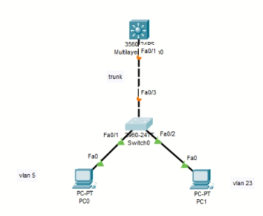

La configuración del switch es la siguiente

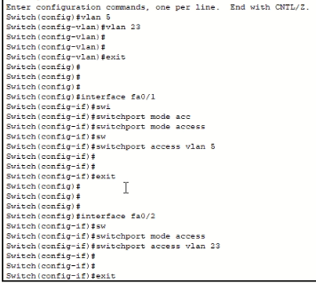

La conexión entre el switch de capa 2 y de capa 3 será en modo truncal

Por lo cual, en el switch de capa 2

```
interface fa0/3
switchport mode trunk
```

Para el switch de capa 3

```sh
vlan 5
vlan 23
exit

interface vlan 5
ip address 192.168.5.254 255.255.255.0
no shutdown
exit

interface vlan 23
ip address 192.168.23.254 255.255.255.0
no shutdown

interface fa0/1

switchport trunk encapsulation dot1q
# Falla si no activamos el comando de arriba
switchport mode trunk
exit

# Debemos habilitar el enrutamiento
ip routing
# También se puede habilitar router rip

# No olvidar configurar ip y gateway a los hosts

show ip route
```

Si alguna interfaz la queremos ocupar como router en lugar de como switch

```sh
interface fa0/2
no switchport
ip address 192.168.200.1 255.255.255.0
```
