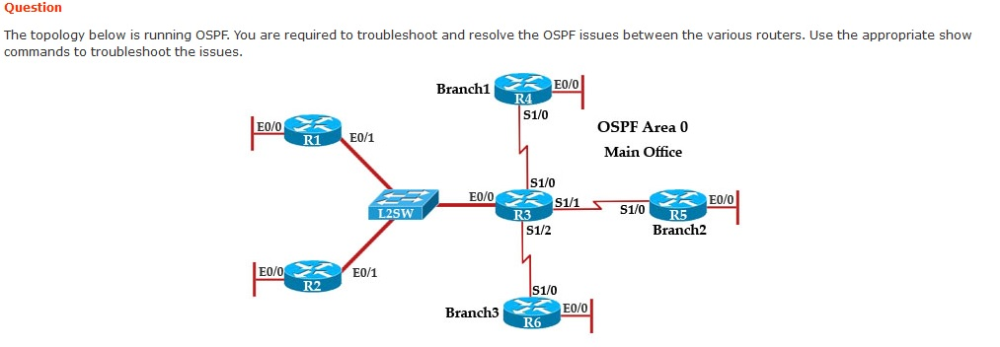
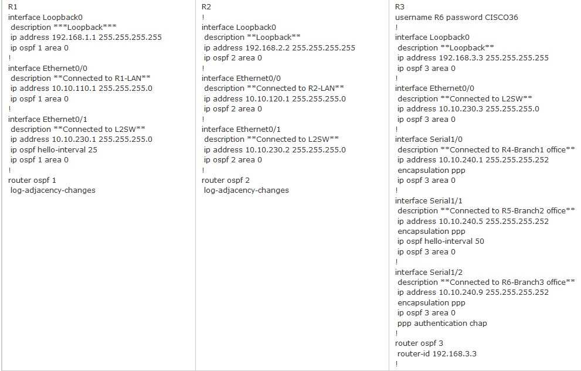
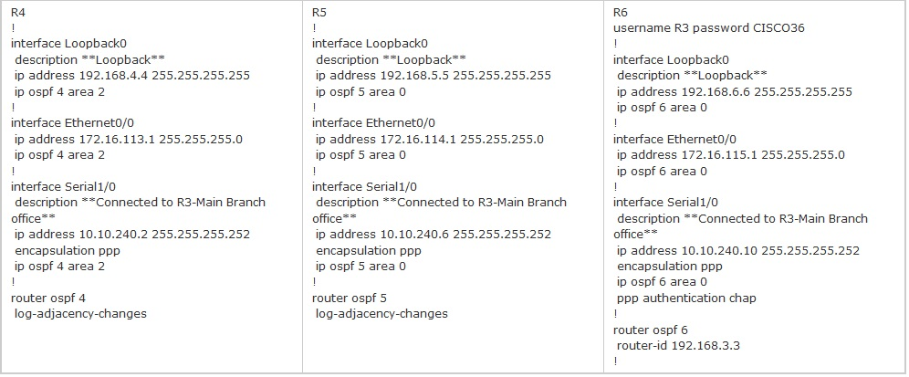

= Troubleshooting
Creado por Rodrigo Francisco <rhodfra@gmail.com>
Version 1.0, 07.01.2021
:description: Semana 14 del curso de CCNA
//:keywords: 
//:sectnums: 
// Configuracion de la tabla de contenidos
//:toc: 
//:toc-placement!:
//:toclevels: 4                                          
//:toc-title: Contenido

// Ruta base de las imagenes
//:imagesdir: ./README.assets/ 

// Resaltar sintaxis
:source-highlighter: pygments

// Iconos para entorno local
ifndef::env-github[:icons: font]

// Iconos para entorno github
ifdef::env-github[]
:caution-caption: :fire:
:important-caption: :exclamation:
:note-caption: :paperclip:
:tip-caption: :bulb:
:warning-caption: :warning:
endif::[]

Rodrigo Francisco Pablo, gpo. 1

//toc::[]

== Ejercicio 1

Pregunta 1:: El Servidor1 y el Servidor2 no pueden comunicarse con el resto de
la red. Su verificación inicial con los administradores del sistema muestra que
la configuración de la dirección IP está configurada correctamente en el lado
del servidor. ¿Cuál es el problema? 

Se configuró mal el router on stick. Se asignó mal el identificador de vlan 
en la configuración de la encapsulación para las interfaces virtuales 100 y 200.

Pregunta 2:: Los usuarios de la oficina principal se
quejan de que no pueden acceder a los sitios de Internet momentaneamente.
Observa que el tráfico de Internet destinado al router ISP no se reenvía
correctamente en el router R1. ¿Cuál es el problema? 

La ip estática por defecto esta mal configurada. 
Debería ser ip route 0.0.0.0 0.0.0.0 209.165.201.2 en R1.
Indicamos que se permitan el trafico de todas las redes con todas las máscaras 
de red.
Además, en rip se agrego el segento de red del ISP lo cual es incorrecto. 

Pregunta 3:: La tabla de enrutamiento en R2 está incompleta ¿Por qué?  

Falta la loopback de router 3
Se debe a que la configuración de RIP se hizo mal en R3. Falto enunciar el 
segmento de red 10.10.12.0
Además de que para comunicarse de R2 a R3 se intenta usar la configuración de
ruta estática por defecto lo cual genera error al estar mal configurada como se
explico en la pregunta anterior.

Pregunta 4:: Examinando la tabla de enrutamiento en R1, el tráfico destinado a
10.10.10.0/24 desde la red LAN R1 usa RIPv2 en lugar de la ruta estática
configurada ¿por qué?

Al estar mal configurada la ruta estatica el router aprenden opta por aprender
la red por RIP dado que se ha declarado en R2 que se conoce dado que esta 
conectada directamente a él.

== Ejercicio 2 (DHCP)

Question 1 ::
Examine the DHCP configuration between R2 and R3, R2 is configured as the DHCP
server and R3 as the client. What is the reason R3 is not receiving the IP
address via DHCP? 

La configuración de adquisición de ip por dhcp no estaba habilitada la interfaz
0/1 de R3.

Question 2 :: 
R1 router clock is synchronized with ISP router. R2 is supposed to receive NTP
updates from R1. But you observe that R2 clock is not synchronized with R1. What
is the reason R2 is not receiving NTP updates from R1?

La ip del servidor NTP esta mal configurada en R2. 
192.168.100.1 no hace referencia a ningún dispositivo de la topología
Debería ser 192.168.10.1, la cual es la ip de la interfaz de R1 que esta
sincronizado con el ISP router.

Question 3 :: 
Why applications that are installed on PC’s in R2 LAN network 10.100.20.0/24 are
unable to communicate with Server1?

Debido a que la lista de control de acceso SERVER1BLOCK evita el trafico entre
las redes LAN de R2 y de R1. Concretamente se bloquea el trabajo del servidor
hacia la PC.

Question 4 :: 
Users complain that they are unable to reach internet sites. You are 
troubleshooting internet connectivity problem at main office. Which statement 
correctly identifies the problem on Router R1?

El nat esta mal configurado en las interfaces. En Fa0/0 debería ser de salida
y en fa0/1 y fa1/0 debería ser de entrada dado que pertenecen a nuestra
topología

== Ejercicio 3 (OSPF)

Utilizar la siguiente información 

Question 1:: 
An ospf neighbor adjacency is not formed between r3 in the main office and r4 in
the branch1 office. what is causing the problem?

Los ids de la configuración de OSPF son distintos. En R3 es 3 y en R4 es 4.
Ambos debería tener el mismo valor.

Question 2:: 
An ospf neighbor adjacency is not formed between r3 in the main office and r5 in
the branch2 office. what is causing the problem? 

Los tiempos de _hello_ no coinciden lo cual provoca fallas en la comunicación.
En R3 se configuro para el tiempo de hello fuera de 50, mientras que R5 usa la
configuración por defaul que es 10.

Question 3:: 
R1 does not form an ospf neighbor adjacency with r2. which option would fix the
issue?

Los tiempos de hello no coinciden y se proudce una falla en la comunicación. 
Para repararlo podemos igual los tiempos de hello o quitar la configuración de
_hello_ en R1 utilizando el comando *no* : _no ips ospf hello-interval 25_

Question 4:: 
An ospf neighbor adjacency is not formed between r3 in the main office and r6 
in the branch3 office. what is causing the problem?

Los router tiene el mismo *router-id* y eso no es valido en la configuración de
ospf para una misma área.

