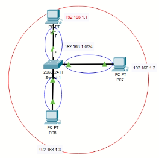

## Semana 2

**(Clase 5, 6)**

CSMA/CD : Detectar colisiones (fallas en los dispositivos)

Interacción entre redes LAN (por eso no ocupamos router)

### Hub vs Switch

| Hub                                                                         | Switch                                                                                |
| --------------------------------------------------------------------------- | ------------------------------------------------------------------------------------- |
| No tiene memoria                                                            | Tiene memria                                                                          |
| Modo half duplex                                                            | Modo full duplex                                                                      |
| Propenso a colisiones (Si una inter faz colisiona, toda la red colisionará) | Los dominios de colisión son separados por interfaz; No falla todo el equipo como tal |

**Half duplex**: O envias o recibes información.

**Full duplex**: Se puede enviar o recibir información al mismo tiempo.

**Dominios de colisión**

En el Switch se separan por interfaz

**Dominios broadcast**

Aplicable a redes LAN

Abarca todo el segmento de red que ocupas

### Mini práctica

1. Utilizamos un hub y 3 hosts, los conectamos

   - Dominios de colisión: Abarca todo porque esa red siempre esta propensa a colisionar [azul]
   - Dominios de broadcast: Abarcaría todo lo que este en la red (Las 3 computadoras) [rojo]

   

2. Utilizar un switch y 3 hosts

   - Dominios de colisión: Como el switch separa por intefaz y se están ocupando 3 intefaces (en este caso los puertos del switch), entonces tenemos 3 dominios de colisión [azul]
   - Dominios de broadcast: Abarcaría todo lo que este en la red (Las 3 computadoras) [rojo]

   

3. Utilizar un router, un swich, un hub y 3 hosts

   - Dominios de colisión: 4 [azul]

     - Una por cada interfaz de switch
     - La del Router y Switch se cuenta ocmo una sola
     - El hub trabaja en halfp duplex por lo tanto si algo falla, todo el segmentos falla
     - De nueva cuenta la unión de switch y hub cuenta como una sola (como el switch)

   - Dominios de broadcast: 2 [rojo]

     - Ojo: El router separa los dominios broadcast, es decir, por cada interfaz del router tengo segmentos de red distintos.

     

4. Mix

   - El cable serial es ocupado para redes WAN, no hay CSMA/CD

   - Dominios de colisión: 7 [azul]

     - No hay colisión en redes WAN

     > _DUDA: ¿Por qué? Según yo es porque no es posible detectar y/o corregir las fallas en una red WAN_

   - Dominios de broadcast: 3 [rojo]

   

### Suite de protocoles vs stack de protocolos

- Suite de protocolos: Son todos los protocolos que puedo utilizar, por ejemplo:
  - HTTP
  - DNS
  - DHCP
  - FTP
  - ETHERNET
  - RIP
  - OSPF
  - EIGRP
- Sack de protocolos: Son protocolos que tienen relación directa, por ejemplo:
  - HTTP - HTTPS - DNS
  - FTP - TFTP
  - TCP - UDP
  - Protocolos de enrutamiento RIP, OSPF, EIGRP

### Tipos de mensajes

- Unicast: Uno a uno.
- Multicast: Uno a un grupo, por ejemplo, separación por grupos de trabajo (brigadas).
- Broadcast: Todos los dispositivos.

> DUDA: ¿Y el anycast?

### Velocidad de los puertos

- Fastethernet = 100 M/bs
- Gibabitethernet = 1000 M/bs

### Cables

- Consola (En packet tracer, azul con terminales circulares )

  Para routers o switches a un equipo final (usuamente para configurarlo o administrarlo)

  Generalmente se ocupa cuando el router o siwtch esta nuevo.

- Cable directo (En packet tracer, negro con picos)

  Host a Switch o Switch a router

- Cable cruzado (En packet tracer, punteado con picos)

  Host a host

  Router a router

  Switch a Switch

  Host a router


### Protocolo ARP e ICMP

**NOTA** La dirección MAC esta escrita en hexadecimal

| ARP (Address Resolution Protocol)  | ICMP (Internet Control Message Protocol)                               |
| ---------------------------------- | ---------------------------------------------------------------------- |
| Finalidad: Cononcer la MAC destino | Válida que haya conexión entre dispositivos                            |
| La MAC por default es: FF:FF:FF:FF |                                                                        |
| Envía mensajes de **Broadcast**    | Envía mensaje **unicast**                                              |
|                                    | Se conoce como **ping**, el mismo ping para checar si tenemos conexión |

Ahora, ¿cómo se hace la comunicación entre dispositivos en una misma red (Si estos nunca se han comunicado)?


Queremos comunicar el host **PC7** (192.168.1.1) con el **PC6** (192.168.1.3

Se intenta hacer ping y en un inicio se tienen esta información:

| Etapa | Acción                                                        | IP_ORIGEN   | IP_DESTINO  | MAC_ORIGEN  | MAC_DESTINO |
| ----- | ------------------------------------------------------------- | ----------- | ----------- | ----------- | ----------- |
| 1     |                                                               | 192.168.1.1 | 192.168.1.3 | AA:AA:AA:AA | ?           |
| 2     | ARP                                                           | 192.168.1.1 | 192.168.1.3 | AA:AA:AA:AA | FF:FF:FF:FF |
| 3     | Respuesta del host PC6 al mensaje ARP                         | 192.168.1.1 | 192.168.1.3 | AA:AA:AA:AA | CC:CC:CC:CC |
| 4     | Se almacena la MAC de la respuesta en la Tabla Mac del Switch | Igual       | Igual       | Igual       | Igual       |
| 5     | La información llega al host que quiere hice ping             | Igual       | Igual       | Igual       | Igual       |
| 6     | Sale en mensaje ICMP (ping)                                   | Igual       | Igual       | Igual       | Igual       |

**Tabla MAC**

Es una tabla almacenada en la memoria del Switch que contiene:

- Intefaz
- Mac

| INTERFAC | MAC         |
| -------- | ----------- |
| fa01/1   | AA:AA:AA:AA |

**Flujo del mensaje ARP**

Por broadcast se envía a todos los host que esten conectados a switch, menos a quién lo envió.


Notése que a PC8 también le llegó el mensaje ARP pero lo rechazó porque no era el host objeto (lo se por sus direcciones IP)

> DUDA: ARP lo envía el switch? También podría enviarlo un router? O lo envía en equipo?

**Cómo el host PC6 y PC7 ya tienen sus direcciones MAC en la tabla MAC, simplemente se envían mensaje de manera directa**

Veamos el **flujo del ICMP** (flechas en azul)


### Mini práctica

1. Con la topología anterior, configuramos las _ip_'s de cada host (Click en el host -> desktop -> Ip configuration ->Usar estáticas)

2. Buscar la MAC (Abrir terminal de windows)

   **Nota:** Aparece como "physical address"

   ```
   ipconfig \all
   ```

3. Pasarse a _modo simulación_

4. Para ver la tabla en el switch

   - En modo privilegiado

   ```
   show mac address-table
   ```

   Para empezar desde cero con la simulación podemos limpiar la tabla MAC

   ```
   clear mac address-table
   ```

5. Hacer ping desde PC7 a PC6

6. Dar click play (El simbolo play) en el panel de la derecha

El mensaje ARP después de regresar al host que quiere hacer ping se ve así


**Tabla ARP**

Esta en los host

Podemos ver

- MAC
- IP

Para verla en el host

```
arp -a
```

| Internet Address | Physical Address | Type    |
| ---------------- | ---------------- | ------- |
| 192.168.1.3      | 00c.854b.1b6d    | dynamic |

Esta tabla muestra destinos, _ip_'s y _mac_'s

### Arquitectuas

Recordando que tenemos tres formas de admin. un equipo CISCO

- Consola
- Remoto (Línea virtual)
- Auxiliar

Un **servidor** es

- Dispositivo que simepre esta a la escucha
- Responde peticiones
- Conocido como demonio

#### Arquitectua red entre partes

Mis host se comportan como **clientes** y **servidores** a la vez.

#### Arquitectura cliente servidor

Un host hace peticiones (cliente) y otro host (servidor) las responde.

Para generar esta arquitectura (esta comunicación) se hace un uso del concepto de **socket**

**Socket = Ip + Puerto**

### Configuración de servicios Telnet y Secure Shell (SSH)

La confiruación es a nivel de switch o router, se deben habilitar las líneas virtuales

#### Telnet

- Trabaja en el puerto 23
- La información viaja en texto plano


1. Configuración de switch

```sh
# modo config global
username rodrigo secret francisco
enable secret pablo
# Numero de lineas que pueden administrar al mismo tiempo (16)
# Habilitando lineas virtuales
line vty 0 15
# modo configuracion de linea
login local

# Colocarle una ip al switch
interface vlan 1
ip address 192.168.1.254 255.255.255.0
no shutdown
```

2. Colocarle ip a mi host (vía GUI)

3. Hacer ping al switch

4. Conectarse desde el host

   ```
   telnet 192.168.1.254
   ```

   Poner las credenciales

#### SSH

- Trabaja en el puerto 22
- La información viaja cifrada


> DUDA: ¿Por qué no se prefiere configurar el Switch con ssh?

1. Configuración

   ```sh
   # modo config global
   username rodrigo secret francisco
   enable secret pablo
   hostname R1
   ip domain name CCNA
   crypto key generate rsa
   # Aparecerea un prompt, escribimos 1024
   ip ssh authentification-retries 2
   ip ssh time-out 60
   ### Levantar modelo de seguridad: authentification-authorization-account
   aaa new-model
   # Numero de lineas que pueden administrar al mismo tiempo (16)
   # Habilitando lineas virtuales
   line vty 0 15
   # modo configuracion de linea
   transport input ssh
   # No podemos ocupar login local por aaa

   exit
   # modo config de interfaz
   # Colocarle una ip al switch
   interface gi0/0/0
   ip address 192.168.1.254 255.255.255.0
   no shutdown
   ```

2. Modificar la ip del host

3. Entrar al command prompt

   ```
   ssh -l rodrigo 192.168.1.254
   ```

### Tarea 2

De la clase número 5, como entregable hay que enviar por correo los siguientes ejercicios contestados donde en cada imagen deben de encerrar

- los dominios de colisión y
- los dominios broadcast,
- al igual deben colocar en la imagen el número total de colisiones y broadcast...

**Y La simulación**

De la clase número 6, se debe enviar por correo la simulación del video solo las configuraciones de telnet y ssh.

**Ejercicio práctico**

Deberán adjuntar también la simulación que se presenta en la siguiente imagen respetando las IP´s colocadas a lado de los host, switches y router.

Favor de colocar en el mismo correo

- sus usuarios y
- contraseñas utilizadas para yo poder entrar por telnet y ssh,
- asi como la contraseña de enable
  - ya sea la misma en todos los equipos o diferentes para cada uno, eso es libre y se los dejo a su criterio.
