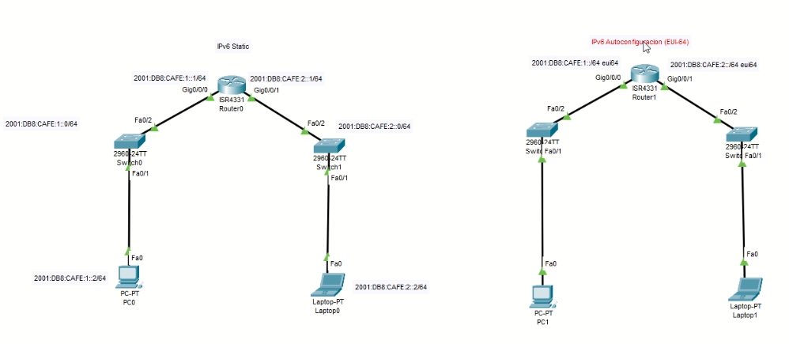
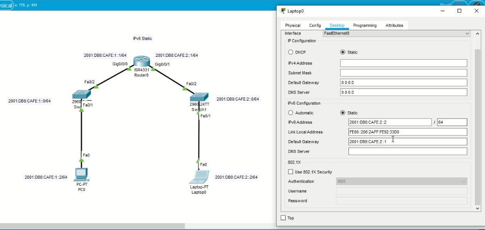

## Semana 3

**(Clases 7, 8, 9)**

### Direccionamiento IPv4

* Compuesta por 32 bits
  * Separados en 4 **octetos**
  * Cada octeto se convierte a decimal, está separado por un "."
* La IP es un identificador
  * Es más fácil de trabajar (aprender) que la MAC
* Existen direcciones IP's 
  * Públicas
    * Por ejemplo la 8.8.8.8 (De google) 
  * Privadas
* Cada Ip cuenta  con una máscara de subred
  * Se escribe en la misma notación que la IP
  * Representa la dirección de IP que esta asignada al segmento de red

#### Clasificación de IP's con clase

* Clase A: 0.0.0.0/8 a 127.0.0.0/8						Máscara = 255.0.0.0
* Clase B: 128.0.0.0./16 a 191.255.0.0/16          Máscara = 255.255.0.0
* Clase C: 192.0.0.0/24 a 223.255.255.0/24       Máscara = 255.255.255.0

### Rango de IP's privadas

* 10.0.0.0/8 a 10.255.255.255/8
* 175.76.0.0 a 175.31.255.255/12
* 192.168.0.0/16 a 192.168.255.255/16

**Todas las demás son IP's públicas** 

### Variable Length Subnet Mask (VLSM)

Esta hecho para no desperdiciar direcciones IP

* Por cada partición necesitamos obtener:
  * Segmento de red
  * Rango de IP's útiles y la IP de broadcast
* Es poco escalable

**Reglas**

* Acomodar de mayor a menor los números de host solicitados

#### Ejemplo

Segmento de red: 192.168.1.0/24

Los requerimientos son:

* A = 80 hosts
* B = 24 hosts
* C = 4 hosts
* D = 40 hosts

**Acomodamos** 

* A = 80
* D = 40
* B = 24
* C  = 4

| Pos  |           | 7ma  | 6ta  | 5ta  | 4ta  | 3era | 2da  | 1era | 0th  |                  |
| ---- | --------- | ---- | ---- | ---- | ---- | ---- | ---- | ---- | ---- | ---------------- |
| 1    |           | 128  | 64   | 32   | 16   | 8    | 4    | 2    | 1    | Binario          |
| 2    | 192.168.1 | 256  | 128  | 64   | 32   | 16   | 8    | 4    | 2    | núm máx de Hosts |
| 3    |           | 0    | 0    | 0    | 0    | 0    | 0    | 0    | 0    | segmento de A    |
| 4    |           | 0    | 1    | 1    | 1    | 1    | 1    | 1    | 1    | broadcast        |
| 5    |           | 1    | 0    | 0    | 0    | 0    | 0    | 0    | 0    | segmento de D    |
| 6    |           | 1    | 0    | 1    | 1    | 1    | 1    | 1    | 1    | broadcast        |
| 7    |           | 1    | 1    | 0    | 0    | 0    | 0    | 0    | 0    | segmento de B    |
| 8    |           | 1    | 1    | 0    | 1    | 1    | 1    | 1    | 1    | broadcast        |
| 9    |           | 1    | 1    | 1    | 0    | 0    | 0    | 0    | 0    | segmento de C    |
| 10   |           | 1    | 1    | 1    | 0    | 1    | 1    | 1    | 1    | broadcast        |

De 192.168.1.0/24

* El prefijo de la máscar es 24, significa primeros 24 bits represetan el segmento de red. Los de más son para los hosts

Siempre debo sumarle 2 a número de host que me soliciten

* La dirección broadcast 
* Segmento de red

**Para A = 80**

Se elige el bit en la septima posición (128), se pasa pero ya no se desperdicia tanto

* Segmento de red: 192.168.1.0
* Broadcast: 
  * Nos vamos al binario y sumamos: 64 + 32 + 16 +8 + 4 +2 +1 = 127
* Rango de IPs
  * Inicial: 192.168.1.0 + 1 = 192.168.1.1
  * Inicial: 192.168.1.127 - 1 = 192.168.1.126
* Máscara y prefijo
  * Prefijo: /25 porque son los bits que ya estan ocupados para el segmento de red
  * Máscara: 255.255.255.**128** (Se transformo de binario a decimal los números encedidos en el último octeto)

**Para D = 40**

* Segmento de red: 192.168.1.**128** (El 128 sale porque es la siguiente dirección disponible, después de las que se ocuparon para A)
  * Quiere decir que el segmento se representa como 10000000 (el último octeto, ver paso 5 el tabla)
* Broadcast:
  * Vemos que debemos tener espacio para 40 + 2 host, el más cercano sería 64. Por lo tanto apartir de ahí prendemos los 1's de izquierda a derecha. No olvidar que ya teníamos encendida la posición 7 (Ver paso 6 de la tabla).
  * 128  + 32 + 16 + 8 + 4 +2 +1 = 191
  * Entonces queda como 192.168.1.191
* Rangos de IPs
  * Inicial: 192.168.1.128 + 1 = 192.168.1.129
  * Final: 192.168.1.191 - 1 = 192.168.1.190
* Máscara y prefijo
  * Prefijo: 26. Porque teníamos 24 de los 3 octetos que no podemos tocar más 1 (correponde al 128), más 1 (corresponde a 64), (Ver tabla).
  * Máscara: 255.255.255.**192** (128 + 64)

**Para B**

* Segmento de red: 192.168.1.192
* Broadcast: 192.168.1.223
* Rango IPs: 192.168.1.193 a 192.168.1.222
* Máscara: 
  * Prefijo : /27
  * 225.255.255.224

**Para C**

* Segmento de red: 192.168.1.224
* Broadcast: 192.168.1.231
* Rango IPs: 192.168.1.225 a 192.168.1.230
* Máscara: 
  * Prefijo : /29
  * 225.255.255.248

En resumen queda así:


VLSM es poco escalable. Generalmente se usa para cuando ya conoces la red, cuando casi no va a cambiar.

Calculadora de VLSM

https://subnettingpractice.com/vlsm.html

### Direccionamiento Ipv6

* Cada dirección consta de 128 bits 
  * Divididos en 8 segmentos y escritos en hexadecimal
* No hay mensaje broadcast
* A la máscara se le llama **prefijo**

**Tipos de direcciones**

* Unicast
  * global unicast 2000::/3 a 3FFF::/3 (públicas)
  * link local FE80::/10 a FEBF::/10 (privadas)
    * Ya vienen configuradas en nuestro dispositivo
* Multicast
  * FE00::/8
* Anycast
  * Similar al broadcast (nos ayuda a simularlo)

**Formas de direccionamiento**

* Estática
* DHCPv6
* Autoconfiguración (EUI-64)

**Reglas para sintetizar una dirección IPv6**

1. Quitar ceros a la izquierda
2. Si en un segmento hay puros 0, se puede sustituir por uno solo
3. La regla de los 2 puntos
   * **OJO:** Solo se puede aplicar una vez

Se pueden aplicar las 3 reglas, 1 sola o 2.

**Ejemplo 1:** 2001:0DB8:CAFE:0001:0000:0000:0ABD:0001

* Aplicando regla 1: 2001:DB8:CAFE:1:000:000:ABD:001
* Aplicando regla 2: 2001:DB8:CAFE:1:0:0:ABD:1
* Aplicando regla 3: 2001:DB8:CAFE:1::ABD:1

**Ejemplo 2:** 0000:0000:CAFE:0001:0000:0000:0ABD:0001

**Esto no queda claro:** ::CAFE:1::ABD:1

#### Mini práctica

Armar las siguientes topologías



##### Configuración estática

**Configuración del router**

```
enable
config t
ipv6 unicast-routing

interface gi/0/0/0
ipv6 address 2001::DB8:CAFE:1::1/64
no shutdown

interface gi/0/0/1
ipv6 address 2001::DB8:CAFE:2::1/64
no shutdown 
```

**Configuración del host**

Se hace vúa interfaz gráfica

Para la PC0


Para la laptop0



> Gateway: Lo configuramos para conectarnos con dispositivos que se encuentren en otros segmentos de red.
>
> Para este caso es la ip de la interfaz de router

Verificar comunicación

```
ping <dirIPv6>
```

##### Configuración IPv6 autoconfiguración (EUI-64)

Misma topología

EUI-64:

* Los últimos 64 bits del total de 128 bits de mi dirección IPv6 va a ser completada con la dirección MAC del dispositivo.

* Para completar la dirección IPv6 se hace lo siguiente:

  

**Configuración del router**

```
ena
config t

ipv6 unicast-routing
interface gi0/0/0
ipv6 address 2001:db8:cafe:1::/64 eui-64
no shutdown

interface gi0/0/1
ipv6 address 2001:db8:cafe:2::/64 eui-64
no shutdown
```

Los host los pasamos a IP automatic

Se hace vía interfaz gráfica


Comprobar en *Command prompt*

```
ipconfig /all
```

Comprobar conexión ente host con un *ping*

